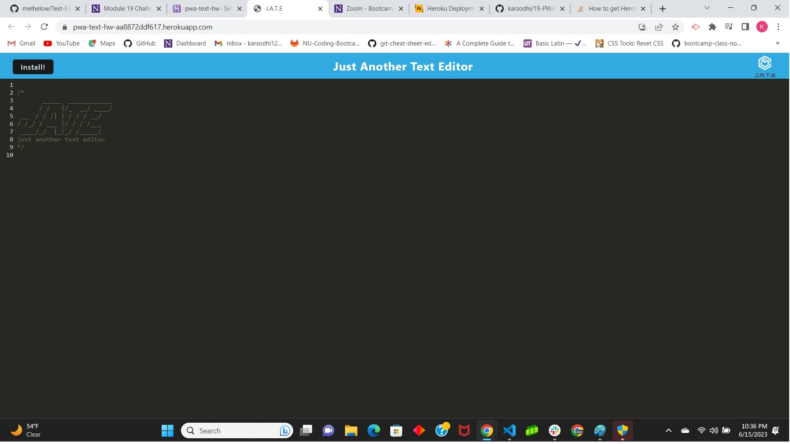

# 19-Progressive-Web-Applications
This is my 19th  homework assignment.  The task was to build a text editor that runs through the browser and can also be installed.The app will be a single-page application that meets the PWA criteria. The application will also function offline.

# usage
the website contains HTML, CSS, Javascript , express, PWA, front end & back end

# deployed link
https://pwa-text-hw-aa8872ddf617.herokuapp.com/
# github
https://github.com/karsodhi/19-PWA-Homework
# mentions
worked with TA and class for this homework assignment 

